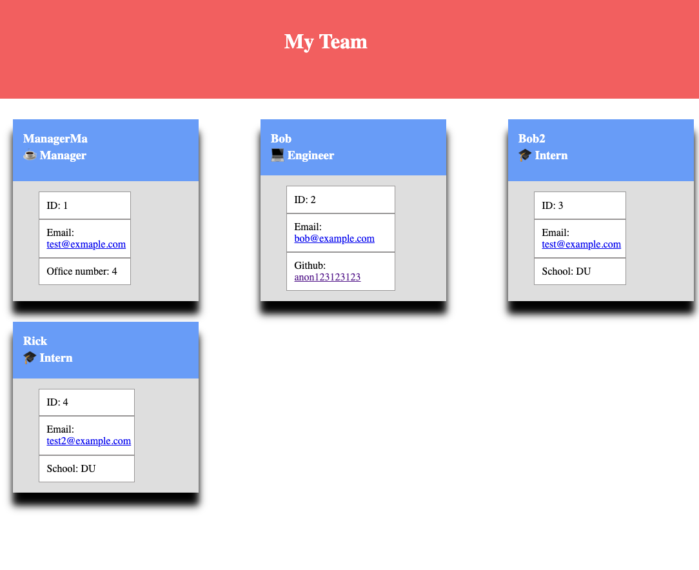

# Team Profile HTML Generator 
<div id="top"></div>

<!-- TABLE OF CONTENTS -->
<details>
  <summary>Table of Contents</summary>
  <ol>
    <li>
      <a href="#about-the-project">About The Project</a>
      <ul>
        <li><a href="#built-with">Built With</a></li>
      </ul>
    </li>
    <li>
      <a href="#getting-started">Getting Started</a>
      <ul>
        <li><a href="#prerequisites">Prerequisites</a></li>
        <li><a href="#installation">Installation</a></li>
      </ul>
    </li>
    <li><a href="#usage">Usage</a></li>
    <li><a href="#contact">Contact</a></li>

  </ol>
</details>


<!-- ABOUT THE PROJECT -->
## About The Project



This class project is to create a CLI tool with Node.js that generates a employee management HTML page.

About:
* The tool allows for a manager, engineer and intern to be added  
* The code leverages Jestjs for unit testing 
* The tool outputs an HTML document with user supplied employees


<p align="right">(<a href="#top">back to top</a>)</p>


### Built With

* [Node.js](https://nodejs.dev/)
* [Inquirer.js](https://www.npmjs.com/package/inquirer)
* [Jestjs](https://jestjs.io/)


<p align="right">(<a href="#top">back to top</a>)</p>


<!-- GETTING STARTED -->
## Getting Started

To get a local copy up and running follow these simple example steps.

### Prerequisites

* npm
  ```sh
  npm install npm@latest -g
  ```

### Installation

1. Clone this repo 
```sh
git clone git@github.com:anon123123123/du-team-profile-gen-proj-8.git
```
2. Install NPM packages
   ```sh
   npm install
   ```
3. That's all there is to it!


<p align="right">(<a href="#top">back to top</a>)</p>


<!-- USAGE EXAMPLES -->
## Usage

Once installed run `npm run start` and follow the interactive command prompts. Once finished the HTML file will be written to ./dist/index.html

_For more examples, please refer to the [VIDEO](https://youtu.be/OMOG9uH1VxI)_

_And example HTML file generated [HTML file](./dist/index.html)_

<p align="right">(<a href="#top">back to top</a>)</p>


<!-- CONTACT -->
## Contact

Project Link: [https://github.com/anon123123123/du-team-profile-gen-proj-8](https://github.com/anon123123123/du-team-profile-gen-proj-8)

<p align="right">(<a href="#top">back to top</a>)</p>


